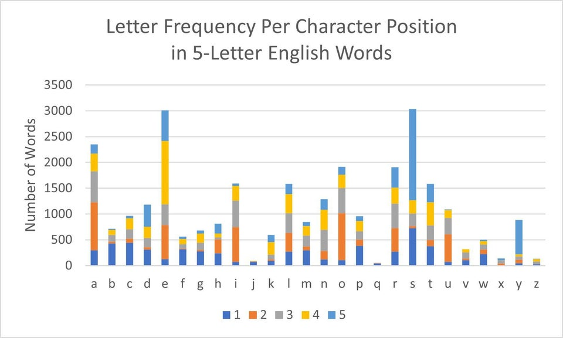

I've been seeing a lot of Wordle data visualizations recently, especially about how good/strong the first word choices are. I've always liked playing word games. When I was younger and my grandmother would watch me, her and I played a lot of scrabble, boggle, and other fun games together. In scrabble it was always a toss up of who was going to win, but it boggle she showed no mercy and I could rarely beat her. Regardless, it was always fun to do. We did play other games like trivial pursuit, but since that game was from the 80's, I had no chance unless the questions were about music or movies. I like this visualization because it makes it easy to compare vowels against themselves and against consonants. I do feel like this could've been filtered to answer some of my own questions. One of my first thoughts was of course "s" is the most popular fifth letter because it is used to make words plural. Along with that, "e" being fourth makes sense too since if a word has a long vowel sound like "bike" or "gate", it will most likely have an "e" at the end. And if a three letter word ends in a consonant, "-es" may be needed to make it plural, like "bus" to "buses". Other than "e", second position is the most common for each other vowel which I thought was a cool find. This visualization seems like it was made in excel with the default color choices for a stacked bar chart, but I think it works well to display the message of the vis without having any clashing or colorblind issues. 

