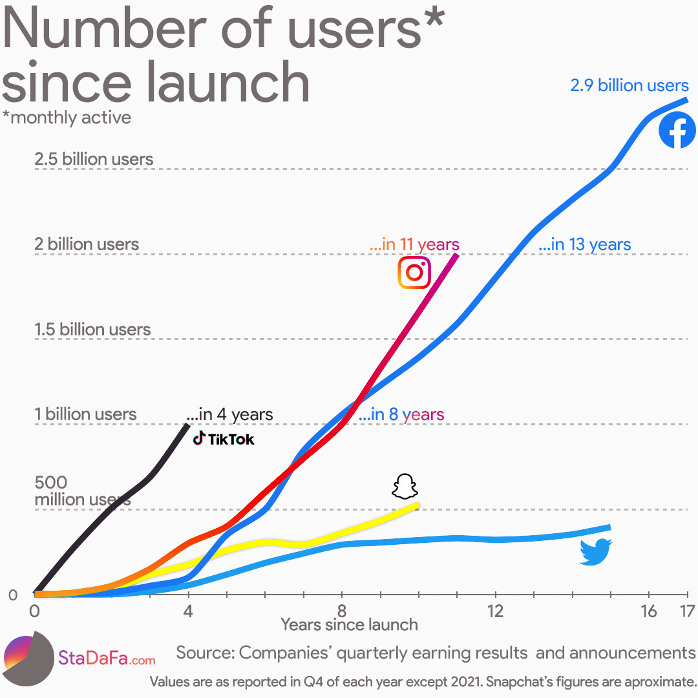

I always like seeing the followage for different social media platforms especially with how things are going on currently in the world, and as someone that uses social media frequently. I'm fairly surprised that Facebook is still growing in popular since they already have so many users. I am curious how much that'll change since Meta might be leaving Europe after the refusal to let Meta collect data on European users. In CS 3043, we discussed the ethics of data and privacy a lot, so it's interesting to see that big companies like Meta don't want to really deal with different regions if they can't collect data on their users. 
Looking at how popular TikTok is, I wonder what this graph would look like if platforms like Vine were still around. TikTok's popularity and growth is clearly unprecedented this early on, so it'll be interesting to see what it'll look like in the next few weeks.
Another surprise was how low the number of Twitter users is. With how many government officials and high-profile celebrities use it daily, it seems like we collectively give their tweets morrre significance than there really is.
Looking at the visualization, even though there are two blues, I feel the colors don't clash with each other and are able to show each platform with thier respective color very well. It also tells the reader what it means by active users, how many years for each platform, and the source of the number of users.

