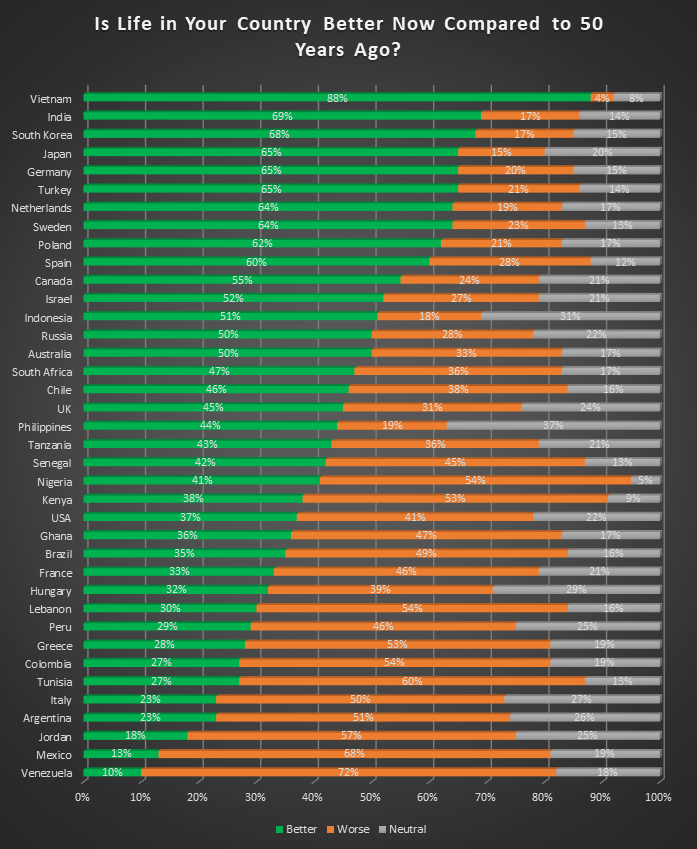

This visualization actually got my attention because I really don't like how it looks. My first gripe is the color usage. Almost every app I use, I almost have it on dark mode, so the dark grey background doesn't bother me. But, the colors for the bars is, in my opinion, poorly chosen. I can understand why using green for "better" but makes a little less since for "worse" being orange. Also, especially since the background AND one of the three values are grey, making the "better" green makes this chart my dad's worst nightmare because of how colorblind he is. Since the background is dark, I feel like a blue or yellow would be better to use because those colors can be seen by him (his color blindless is pretty severe). Another thing I don't like is the ordering of better-worse-neutral. I think it should be better-neutral-worse or worse-neutral-better.

I tried looking through the comments to see who was allowed to/did participate in the survey. Personally, it makes the most since to allow only people that lived through both eras  to avoid only some responses having experience while the other responses have more of a speculation.

It is nice how the countries are more spread out and all over: some from Europe, Asia, North America, and Africa. In a more broad and sophisticated survey, I think it would be interesting to go further and be able to filter out why the people of each country had their reasonings of life better, worse, or the same.

